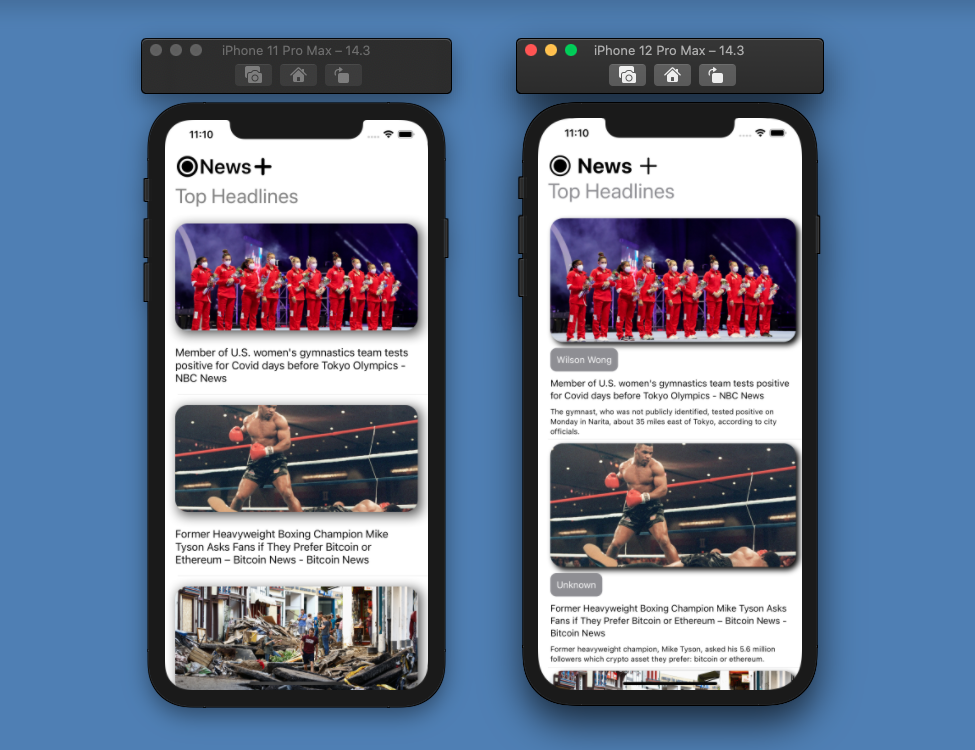

<h1 align="center">
    Tutoriais de aprendizado Dev iOS - Youtube (Canal DevTechie)
</h1

<h1 align="center">
     
</h1>

---

## 🔖  Sobre o estudo dessa aplicação

Já faz uns dias que eu queria achar um tutorial no youtube onde fosse implementada a mesma aplicação, só que uma sendo feita com UIKit e outra com SwiftUI, para poder analisar a diferença entre ambas.

Deixar aqui minha opinião:

Para quem nunca programou na vida e escolheu se aventurar no desenvolvimento mobile iOS, o SwiftUI vai ser a melhor escolha, independente do mercado atual ser em sua grande maioria em UIKit.   
Não foque todos seus esforços no começo em aprender tudo de UIKit ou SwiftUI, foque em saber bem Swift e entender as stacks que rodeiam o desenvolvimento iOS.

iPhone 11 Pro Max, foto da esquerda (UIKit com Viewcode)
iPhone 12 Pro Max, foto da direita (SwiftUI)

## Link dos videos

- [Video em UIKit](https://www.youtube.com/watch?v=Wu3er4AMG8U&list=WL&index=2)
- [Playlist em SwiftUI](https://www.youtube.com/watch?v=srPsrbpQFxY&list=PLbrKvTeCrFAf3BBqfGR9B9C5XXAVa6D4r)

Thyago Raphael - O Noob do iOS  ♥
